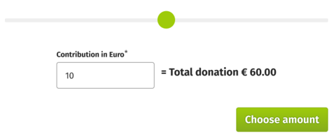

# Frontend Engineer: Technical Challenge

## Task

We want you to build a little co-donation component in React. In betterplace, a co-donation is a voluntary contribution that the user can add on top of a donation.

Have a look at the designs below and recreate it as well as you can from the screenshots.

The form consists of a slider and an input field. The input is the amount of the donation and the slider sets a maximum constraint for the input field. The total amount including the initial donation will be shown next to the input field. Lastly there is a submit button to confirm the selected amount.

Here are some more instructions:

- Your code should be placed in the `src` directory, there is some boilerplate code there created for your convenience.
- The slider goes from 0 to 20. It defines the maximum limit of the input field.
- The input field can be used to set the amount in Euro.
- The input value may be a decimal number.
- When the amount is set to 0 a notice appears, informing the user about what is being done with the contribution.
- Internally the value should be stored as an integer in cents.
- On change or on blur the component will convert the value to cents and emit the new value by running the appropriate handler.
- On submit, the value will be validated.
  - If it is invalid, an error message will be displayed.
  - If it is valid, the internal value will be logged to the console.
- The initial donation will be passed in as a prop.
- A `locale` will be passed in as a prop (e.g. `en` or `de`), that you can use to format the string.
- You may use the tokens provided in `tokens.css` to style the component.

Bonus tasks:

- The code is tested.
- The components are documented in Storybook.
- The input component's interface besides the changes stemming from the functionality described above is identical to the interface of the HTML input element.

### Get started

- Run `pnpm install` to install the dependencies.
- Run `pnpm storybook` to start and open Storybook in the browser.
- Run `pnpm test` to run tests.

### Design

#### Co-donation form

#### Co-donation form with notification

#### Input States

## Submit your solution

You can provide your solution either

- as a zipped file containing the code or
- as a link to a fork of this repository or
- as a link to your own repository.
